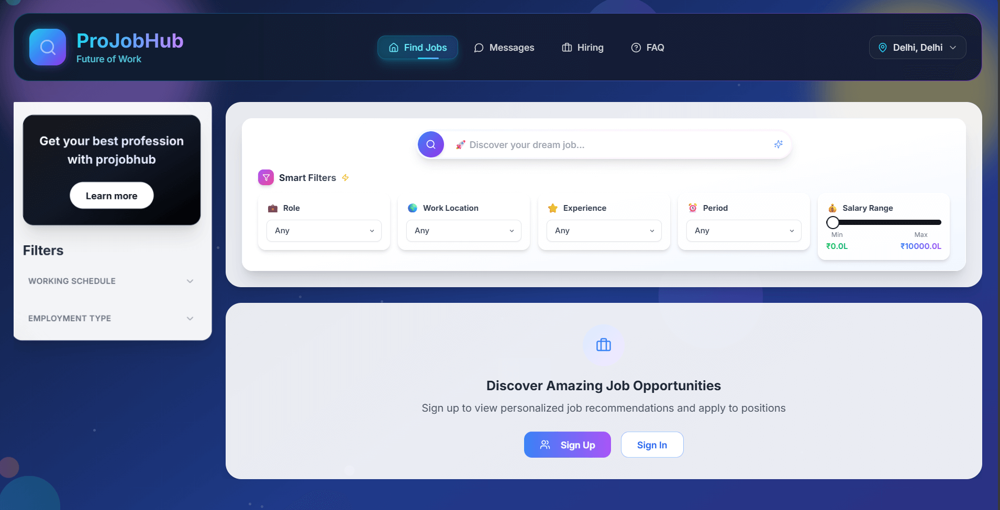

# 🚀 ProJobHub India - Modern Job Portal



**A cutting-edge job portal connecting Indian job seekers with employers nationwide.** Built with React, TypeScript, and Supabase by Krish Yadav.

---

## 🌟 Features

### 🔐 Secure Authentication

* User registration & login via Supabase Auth
* Profile management with professional details
* Role-based access control for Job Seekers & Employers

### 💼 Comprehensive Job Management

* Browse thousands of jobs across India
* Advanced filters: location, salary, experience, job type
* Detailed job view with modal popup
* Post and manage jobs as an employer

### 💬 Real-Time Communication

* Instant messaging between candidates and recruiters
* Application notifications and status updates

### 🎨 Modern UI/UX

* Responsive design across all devices
* Dark/Light mode toggle
* Smooth animations and intuitive navigation

---

## 🛠️ Tech Stack

### Frontend

* React 18 + Hooks
* TypeScript
* Vite
* Tailwind CSS
* shadcn/ui Components

### Backend

* Supabase (Auth & DB)
* PostgreSQL
* Row-Level Security (RLS)
* Real-time Subscriptions

---

## 📦 Getting Started

### 1. Clone the Repository

```bash
git clone https://github.com/krishyadav90/ProJobHub-India.git
cd ProJobHub-India
```

### 2. Install Dependencies

```bash
npm install
```

### 3. Configure Environment Variables

```bash
cp .env.example .env
```

Update `.env` with your Supabase project credentials.

### 4. Start Development Server

```bash
npm run dev
```

---

## 📁 Project Structure

```bash
src/
├── assets/         # Static assets
├── components/     # UI & logic components
│   ├── auth/        # Authentication UI
│   ├── jobs/        # Job-related UI
│   ├── ui/          # Shared components
├── contexts/       # React context providers
├── hooks/          # Custom React hooks
├── lib/            # Helper functions
├── pages/          # Main pages/views
├── services/       # API interaction logic
├── types/          # TypeScript types/interfaces
└── styles/         # Global stylesheets
```

---

## 🌍 Live Demo

**Visit:** [projobhub-india.vercel.app](https://projobhub-india.vercel.app)

---

## 📝 Database Schema

```sql
-- Profiles Table
CREATE TABLE profiles (
  id UUID REFERENCES auth.users,
  name TEXT,
  email TEXT UNIQUE,
  role TEXT, -- 'job_seeker' or 'employer'
  skills TEXT[],
  experience TEXT
);

-- Jobs Table
CREATE TABLE jobs (
  id UUID PRIMARY KEY DEFAULT uuid_generate_v4(),
  title TEXT NOT NULL,
  description TEXT,
  company TEXT,
  location TEXT,
  salary_range TEXT,
  experience_required TEXT,
  job_type TEXT,
  posted_by UUID REFERENCES profiles(id),
  created_at TIMESTAMP DEFAULT NOW()
);

-- Applications Table
CREATE TABLE applications (
  id UUID PRIMARY KEY DEFAULT uuid_generate_v4(),
  job_id UUID REFERENCES jobs(id),
  applicant_id UUID REFERENCES profiles(id),
  status TEXT DEFAULT 'pending',
  created_at TIMESTAMP DEFAULT NOW()
);
```

---

## 🤝 Contributing

We welcome contributions from the community! 🛠️

1. Fork the repo
2. Create a feature branch:

```bash
git checkout -b feature/YourFeatureName
```

3. Commit your changes:

```bash
git commit -m "Add: Your feature description"
```

4. Push to GitHub:

```bash
git push origin feature/YourFeatureName
```

5. Open a Pull Request

---

## 📜 License

This project is licensed under the **MIT License**. See [`LICENSE`](./LICENSE) for details.

---

## 📧 Contact

**Krish Yadav**
📧 [krishyada9865@gmail.com](mailto:krishyada9865@gmail.com)
🐦 [@krishyadav](https://x.com/KRISHYADAV98199)
🔗 [GitHub Repository](https://github.com/krishyadav90/ProJobHub_IND)

---

## 🙏 Acknowledgments

* [Supabase](https://supabase.com) — backend magic
* [Tailwind CSS](https://tailwindcss.com) — utility-first CSS
* [shadcn/ui](https://ui.shadcn.com) — modern UI components
* React community — for inspiration & tools

---

> Made with ❤️ in India 🇮🇳
